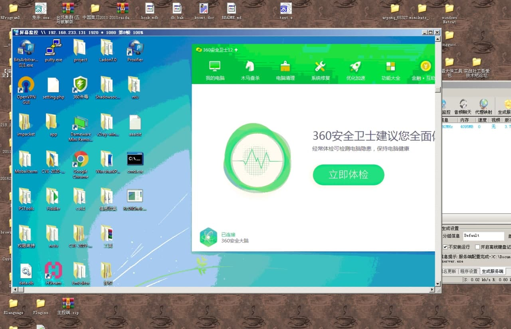
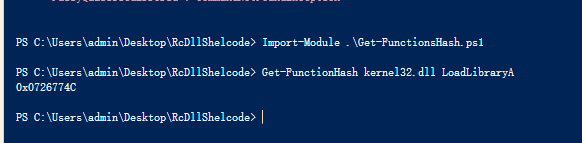

# RmExecute

Remote Download and Memory Execute for shellcode framework

远程下载并内存加载的ShellCode框架，已经支持x64

# 参（抄）考（袭）项目

## [windows下shellcode提取模板的实现](https://bbs.pediy.com/thread-229398.htm)

主要抄袭来源，直接使用这位大佬的shellcode框架，并且强烈推荐看下他文章内的doc，分析的非常好

## [PIC_Bindshell](https://github.com/mattifestation/PIC_Bindshell)

windows api hashing部分直接搬过来的

## [ReflectiveDLLInjection](https://github.com/stephenfewer/ReflectiveDLLInjection)

准备抄袭

## [开（犯）发（罪）过程](https://9bie.org/index.php/archives/750/)

# 效果图



# How to use

## 开箱即用

修改`ShellCode.cpp->StartSCode`函数中的host和path改为您的域名和木马文件即可，之后使用`Release`模式运行，即会在目录下生成`123.bin`文件，之后使用`EXE_RUN_MT`模式编译运行即可加载`123.bin`文件

或是自行调用`123.bin`文件

## 添加API

使用目录下的`Get-FunctionsHash.ps1`脚本添加API HASH到hash.h



之后在`API.H`中添加相关WINAPI 函数指针，作为搜索地址后调用的方式，之后在`API.H->FUNCTIONS`结构体中添加相关成员

之后在`Tool.h->RmExecute::Initfunctions`函数中调用

```c
char szUser32[] = { 'u', 's', 'e', 'r', '3', '2', '.', 'd', 'l', 'l', 0 };
pfn->fnLoadLibraryA(szUser32);
pfn->fnMessageBoxA = (pfnMessageBoxA)GetProcAddressWithHash(HASH_MessageBoxA);
```
搜索函数来加载WINAPI。

之后就可以使用
`fn.fnMessageBox(0, "text", "text", MB_OK);`这样形式来调用winapi了。


## 字符串相关

参考第一个引用的文章链接，字符串必须要使用`{'a','b','\0'};`这样子的立即数形式

# 进阶 （很快）

## 使用XOR加密字符串

隐藏loadlibrary特征和url特征，更不容易被发现

## 反射DLL加载技术

完全不使用LoadLibrary，ProcessExplorer、procexp64等工具无法检测到这个dll，同时让程序变得模块化

## 纯shellcode加载

太奢侈了我就是想想

